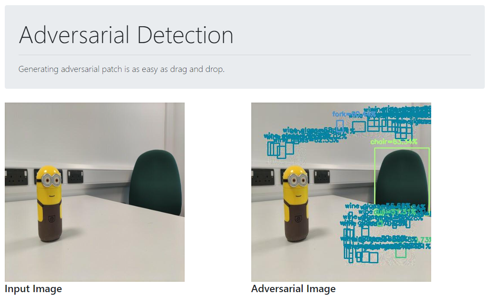

## Adversarial Detection

> Attacking Object Detection Systems in Real Time

[[ Talk ]](https://detection.wuhanstudio.uk) [[ Video ]](https://youtu.be/zJZ1aNlXsMU) [[ Paper ]](https://arxiv.org/abs/2209.01962) [[ Code ]](https://github.com/wuhanstudio/adversarial-detection)

### Overview

Generating adversarial patch is as easy as **drag and drop**.



### Quick Start

You may use [anaconda](https://www.continuum.io/downloads) or [miniconda](https://conda.io/miniconda.html). 

```
$ git clone https://github.com/kkttww/Adversarial-Object-Detection
$ cd adversarial-detection

$ # GPU
$ conda env create -f environment_gpu.yml
$ conda activate adv_gpu

$ python detect.py --model model/yolov3-tiny.h5 --class_name coco_classes.txt
```

The web page will be available at: http://localhost:9090/

That's it!
# YOLOv5-Adversarial
